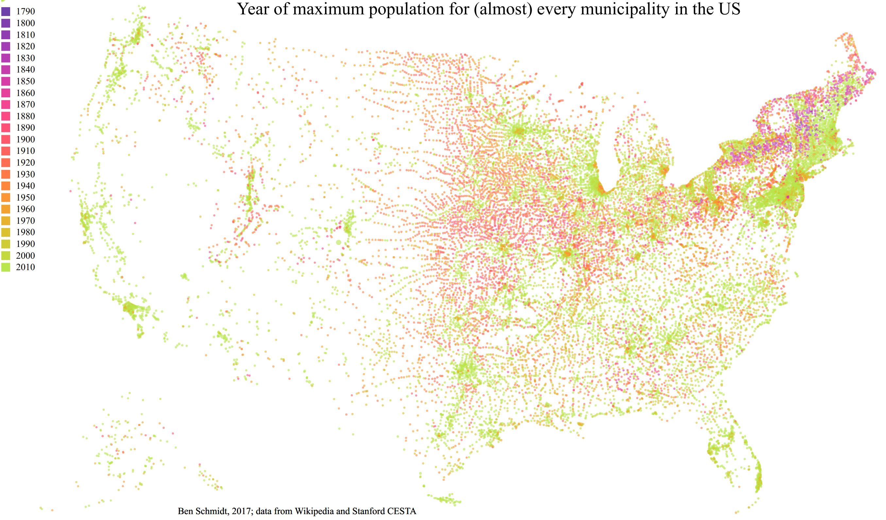

This is a dataset and code that merges three major sources of historical US population data.

It is part of the in-progress [*Creating Data* digital monograph](http://creatingdata.us/). If citing, please
cite that project in addition to this repo. Eg: "Schmidt, Benjamin. *Creating Data: The Invention of Information in the nineteenth century American State.* http://creatingdata.us"

A fuller description of data and method is contained in the file `extended_description.md`.

The sources are:

1. Every Wikipedia page with a population box.
2. A typed set of CSVs by Wikipedia editor Jacob Alperin-Sheriff (which is mostly, but not entirely, on wikipedia)
3. A set of historical populations compiled by Stanford's CESTA.

The most useful files are likely

* [WikiData.csv](WikiData.csv) (The parsed files from wikipedia.)
and
* [merged.csv](merged.csv) (The union dataset.)
* The files in [wiki_census](wiki_census), which are the sources Alperin-Sheriff used to build the wikipedia page.

The wikipedia set is about 4x bigger than the CESTA one. The following maps show roughly the original contributions of each dataset:

![Sources of cities]City Sources.png)

Also included is the code that performs extraction from a wikipedia dump, and which performs the merge
(including a few examples of errors and differences between sets.) These are mostly in ipython notebooks, with a little bit in R notebooks. Most of the operational python code is broken out into the `.py` files.

